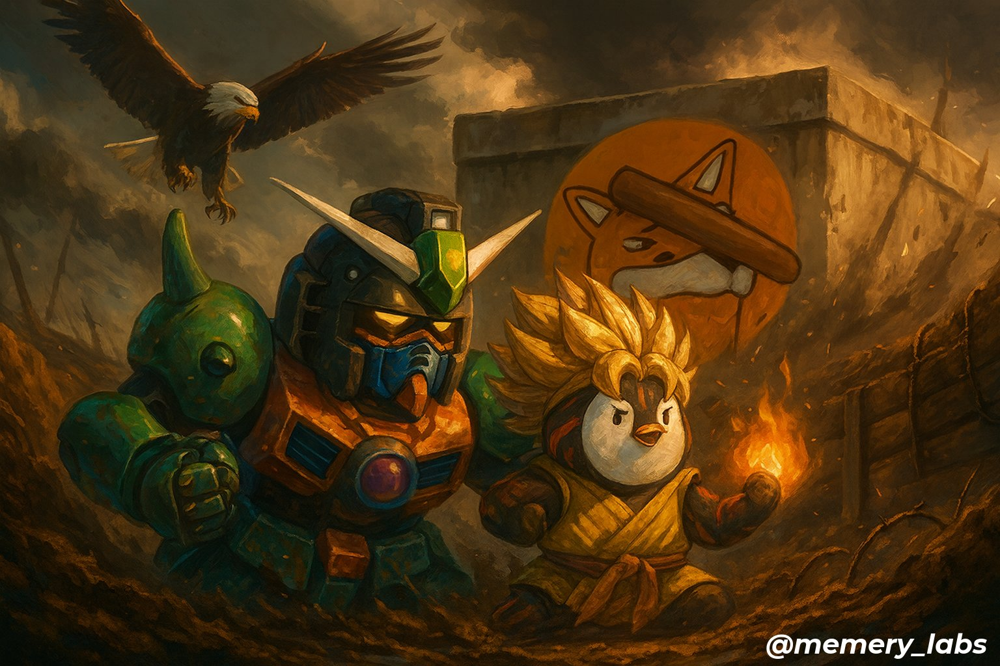
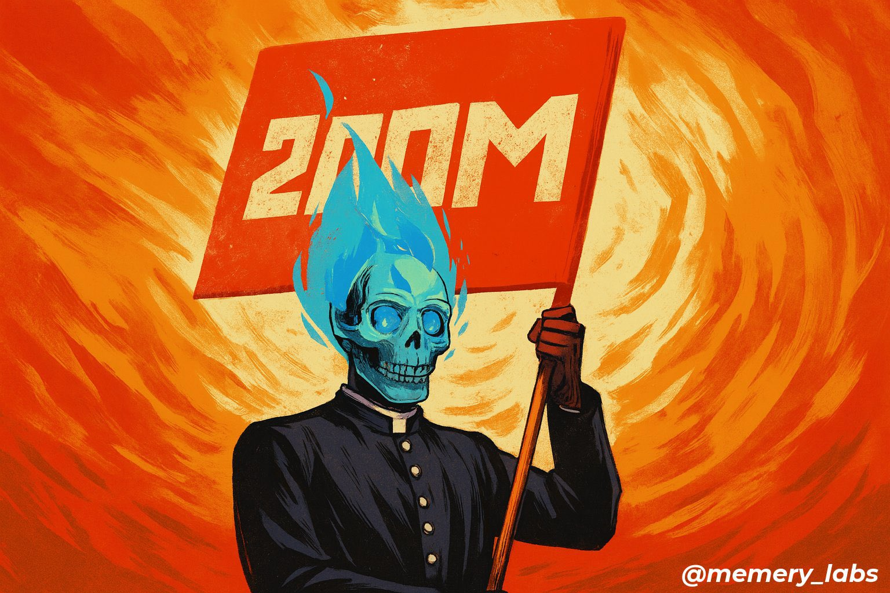
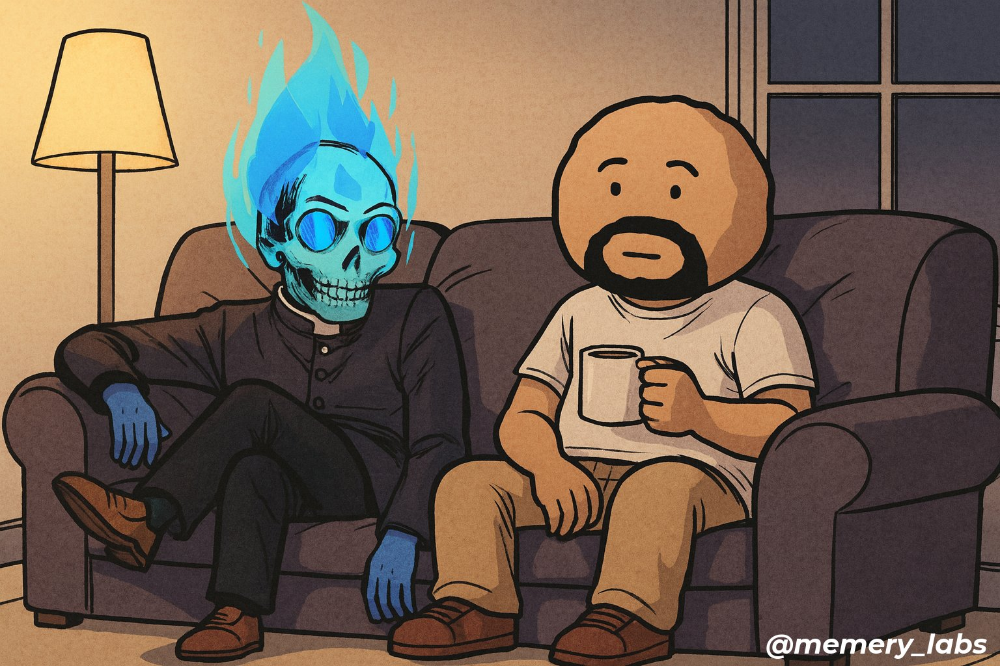
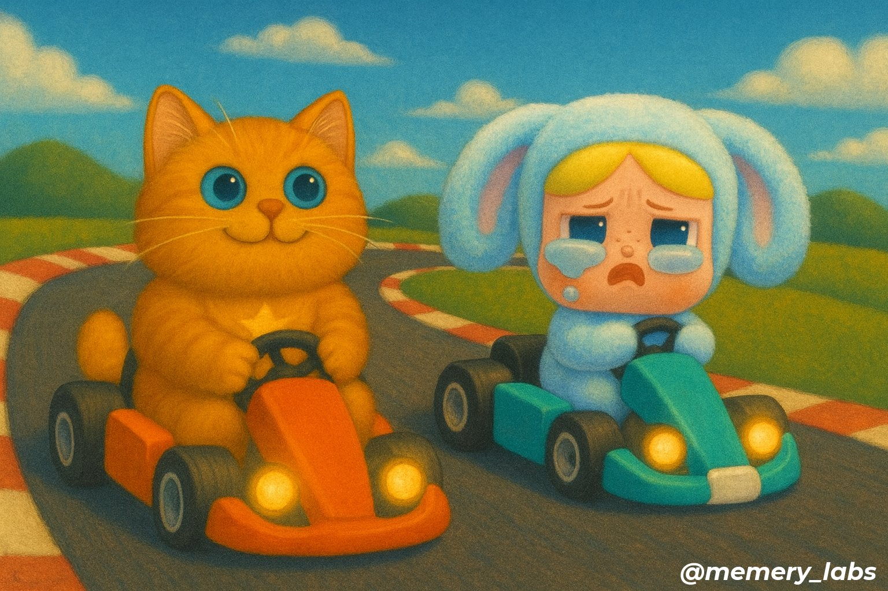

# MemeryAgent

A Twitter image generation agent that creates and posts custom images when mentioned [@memery_labs](https://x.com/memery_labs). Initially built for the [@bonk_fun](https://x.com/bonk_fun) community, the agent serves a wide range of meme generation needs in the crypto space using a minimalist design powered by just two custom tools: [`download_x_profile_picture`](tools/x_profile.py) and [`create_composite_image`](tools/image_generation.py).

The agent's core innovation is autonomously downloading Twitter profile pictures to use as visual context for image generation. Whether the account represents an individual or a meme coin project, profile pictures typically provide excellent imagery representing the underlying entity.

This approach enables users to provide visual context simply by mentioning Twitter handles in their requests—no need to leave Twitter or manually share images.

## Examples

Here are some examples of images generated by MemeryAgent and their corresponding tweets:

<table>
  <tr>
    <td width="50%" valign="top">
      
      <br>
      <strong><a href="https://x.com/yuzhe_lu/status/1961684520618602634">Tweet:</a></strong> <a href="https://x.com/memery_labs">@memery_labs</a> draw a heroic scene of <a href="https://x.com/solporttom">@solporttom</a> and <a href="https://x.com/iamkadense">@iamkadense</a> fighting in the trenches. On their back is a bunker with the <a href="https://x.com/bonk_fun">@bonk_fun</a> logo. A bold eagle is flying over their head, as if they are about to launching an attack.
    </td>
    <td width="50%" valign="top">
      
      <br>
      <strong><a href="https://twitter.com/example_tweet_2">Tweet:</a></strong> <a href="https://x.com/memery_labs">@memery_labs</a>, create an image of <a href="https://x.com/dapanji_eth">@dapanji_eth</a> holding a <a href="https://x.com/the200m_bonk">@the200m_bonk</a> banner.
    </td>
  </tr>
  <tr>
    <td width="50%" valign="top">
      
      <br>
      <strong><a href="https://x.com/dapanji_eth/status/1960593316770406595">Tweet:</a></strong> <a href="https://x.com/memery_labs">@memery_labs</a> create an image of me and <a href="https://x.com/AnAverageJoeSol">@AnAverageJoeSol</a> lounging in the couch
    </td>
    <td width="50%" valign="top">
      
      <br>
      <strong><a href="https://x.com/yuzhe_lu/status/1959074388030234938">Tweet:</a></strong> <a href="https://x.com/memery_labs">@memery_labs</a> create an image of <a href="https://x.com/Hosico_on_sol">@Hosico_on_sol</a> and <a href="https://x.com/Crybaby_on_sol">@Crybaby_on_sol</a> ridding go-karts.
    </td>
  </tr>
</table>

## Development Setup

### Prerequisites
- Python 3.12 or higher
- uv

### Installation

```bash
# Install uv (if not already installed)
curl -LsSf https://astral.sh/uv/install.sh | sh

# Install dependencies using uv (includes dev dependencies)
uv sync --dev

# Activate the virtual environment
source .venv/bin/activate
```

### Environment Variables

Create a `.env` file in the project root with the following variables:

#### For agent.py (AI image generation):
```bash
OPENAI_API_KEY=your_openai_api_key_here
```

#### For main.py (Twitter bot):
```bash
TWITTER_BEARER_TOKEN=your_twitter_bearer_token
TWITTER_API_KEY=your_twitter_api_key
TWITTER_API_SECRET=your_twitter_api_secret
TWITTER_ACCESS_TOKEN=your_twitter_access_token
TWITTER_ACCESS_SECRET=your_twitter_access_secret
MONGODB_URI=your_mongodb_connection_string
```

### Pre-commit Setup (Optional)

Set up pre-commit hooks to automatically format and lint code before commits:

```bash
# Install pre-commit hooks
pre-commit install

# Run pre-commit on all files (optional, to test setup)
pre-commit run --all-files
```

The pre-commit hooks will automatically run:
- Black (code formatting)
- Ruff (linting)
- MyPy (type checking)

### Running the Application

```bash
# Run the AI agent (standalone image generation)
python agent.py

# Run the Twitter bot
python main.py
```

## Deployment

Designed for Railway deployment with:
- Persistent volumes for image storage
- MongoDB Atlas integration for database persistence
